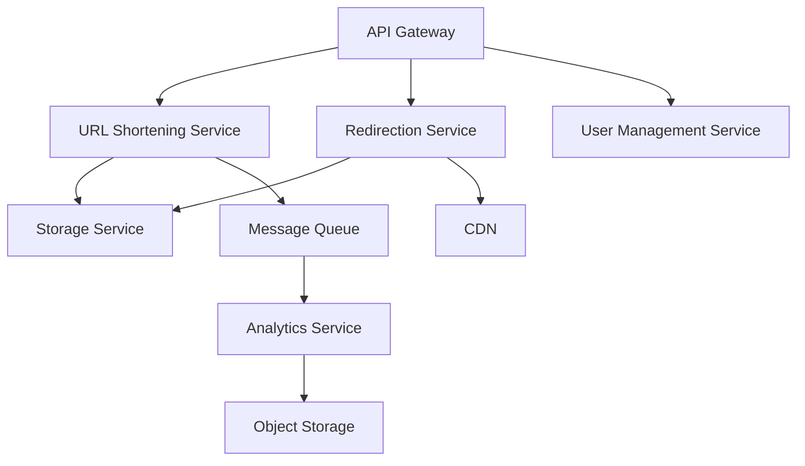

# System Design Multi-Agent System

A multi-agent AI pipeline built with **CrewAI** that takes a single system design prompt and produces a comprehensive, production-ready design document — covering requirements, capacity estimation, architecture, data modeling, API design, scalability, reliability, and more.

---

## How It Works

Nine specialized AI agents collaborate in a strict sequential pipeline. Each agent receives the full accumulated output of every agent before it, so knowledge compounds at each step.

```
User Prompt
     │
     ▼
 1. Requirements Analyst   ──►  functional & non-functional requirements
     │
     ▼
 2. Capacity Estimator     ──►  QPS, storage, bandwidth, server counts
     │
     ▼
 3. System Architect       ──►  component diagram + end-to-end request flow
     │
     ▼
 4. Data Modeler           ──►  database choices, schemas, indexing, sharding
     │
     ▼
 5. API Designer           ──►  endpoint specs, auth, rate limiting
     │
     ▼
 6. Scalability Engineer   ──►  caching, load balancing, auto-scaling
     │
     ▼
 7. Reliability Engineer   ──►  fault tolerance, DR plan, observability
     │
     ▼
 8. Critic                 ──►  bottlenecks, SPOFs, trade-off analysis
     │
     ▼
 9. Synthesizer            ──►  final design document (Markdown)
```

---

## Agent Roster

| # | Agent | Responsibility |
|---|-------|----------------|
| 1 | **Requirements Analyst** | Extracts functional & non-functional requirements, assumptions, and scope |
| 2 | **Capacity Estimator** | Back-of-envelope math — DAU, QPS, storage, bandwidth, server counts |
| 3 | **System Architect** | High-level architecture, Mermaid component diagram, request flow |
| 4 | **Data Modeler** | Database selection, schemas, indexing strategy, sharding, data lifecycle |
| 5 | **API Designer** | REST/gRPC endpoint specs, auth mechanism, rate limiting, versioning |
| 6 | **Scalability Engineer** | Caching layers, load balancing, horizontal scaling, async processing |
| 7 | **Reliability Engineer** | Failure modes, replication, circuit breakers, DR plan, observability |
| 8 | **Critic** | Bottlenecks, single points of failure, over-engineering, prioritized fixes |
| 9 | **Synthesizer** | Merges all outputs into one structured design document |

---

## Output Structure

The final document follows this 9-section format, suitable for a system design interview or engineering RFC:

```
# System Design: [System Name]

## 1. Requirements
## 2. Capacity Estimation
## 3. High-Level Architecture       ← includes Mermaid diagram
## 4. Data Model
## 5. API Design
## 6. Scalability
## 7. Reliability & Fault Tolerance
## 8. Key Trade-offs & Design Decisions
## 9. Future Improvements
```

---

## Example

**Input prompt:**
```
Design a URL shortener service like bit.ly.
It needs to handle 100 million stored URLs and 1 billion redirects per day.
Redirection latency must be under 10ms at p99.
```

**Sample output (Section 3 — Architecture):**


**Sample output (Section 2 — Capacity):**

| Metric | Value |
|--------|-------|
| DAU | 1,000,000 |
| Peak Read QPS | ~11,600 |
| Peak Write QPS | ~230 |
| 5-Year Storage | ~183 TB |
| Read : Write Ratio | 50 : 1 |

---

## Tech Stack

| Component | Technology |
|-----------|-----------|
| Agent framework | [CrewAI](https://github.com/crewAIInc/crewAI) 1.15+ |
| LLM (reasoning) | GPT-4o |
| LLM (estimation) | GPT-4o-mini |
| Runtime | Python 3.13 |
| Package manager | [uv](https://github.com/astral-sh/uv) |
| Interface | CLI (`system-design`) + Jupyter Notebook |

---

## Prerequisites

- Python 3.13+
- [uv](https://docs.astral.sh/uv/getting-started/installation/) package manager
- OpenAI API key

---

## Installation

```bash
# Clone the repo
git clone https://github.com/samruk-code/system_design_multi_agent_system.git
cd system_design_multi_agent_system

# Install dependencies
uv sync

# Set your OpenAI API key
echo "OPENAI_API_KEY=sk-..." > .env
```

---

## Usage

### Command line (recommended)

```bash
uv run system-design "Design a URL shortener like bit.ly. \
It needs to handle 100 million stored URLs and 1 billion redirects per day. \
Redirection latency must be under 10ms at p99."
```

Options:

```bash
uv run system-design "<prompt>" --output design.md   # write the final doc to a file
uv run system-design "<prompt>" --sections            # also print each specialist's individual output
```

Or call it as a library:

```python
from system_design_multi_agent_system import run_design

result = run_design("Design a ride-sharing service like Uber...")
print(result.final_document)      # final synthesized Markdown document
print(result.sections)            # [(title, markdown), ...] per specialist agent
```

### Jupyter Notebook

```bash
uv run jupyter notebook notebook/system_design_multi_agent_system.ipynb
```

Open the notebook, change the `user_prompt` in **Section 6**, then run all cells.

### Command line (nbconvert)

```bash
uv run jupyter nbconvert --to notebook --execute --inplace \
  notebook/system_design_multi_agent_system.ipynb \
  --ExecutePreprocessor.timeout=900
```

Any system design prompt works — URL shorteners, social feeds, payment systems, chat apps, etc.

---

## Project Structure

```
system_design_multi_agent_system/
├── src/
│   └── system_design_multi_agent_system/
│       ├── __init__.py     # Exposes run_design()
│       ├── llms.py         # LLM configuration (gpt-4o, gpt-4o-mini)
│       ├── agents.py       # The 9 specialist Agent definitions
│       ├── tasks.py        # The 9 sequential Task definitions
│       ├── crew.py         # Assembles agents + tasks into a Crew
│       ├── runner.py       # run_design() — kicks off the crew, returns results
│       └── main.py         # CLI entry point (`system-design`)
├── notebook/
│   └── system_design_multi_agent_system.ipynb   # Interactive notebook version
├── .env                                          # OPENAI_API_KEY (not committed)
├── pyproject.toml                                # Project dependencies + CLI entry point
├── uv.lock                                       # Locked dependency versions
└── README.md
```

---

## Design Decisions

**Why sequential instead of parallel?**
CrewAI 1.x requires that async tasks only reference sync tasks in their `context`. Since later agents (Data Modeler, API Designer) benefit from the Architect's output, fully sequential execution is both simpler and produces higher quality results — each agent builds on complete prior knowledge.

**Why `ThreadPoolExecutor` in the notebook?**
Jupyter keeps its own asyncio event loop running. CrewAI's sync execution bridge (`loop.run_until_complete`) raises `RuntimeError: This event loop is already running` in that context. Running the crew in a worker thread gives it a fresh thread with no running event loop.

**Why two LLMs?**
The Capacity Estimator performs structured arithmetic — it doesn't need GPT-4o's reasoning depth. Using GPT-4o-mini for that task cuts cost and latency without affecting output quality.

---

## License

MIT
